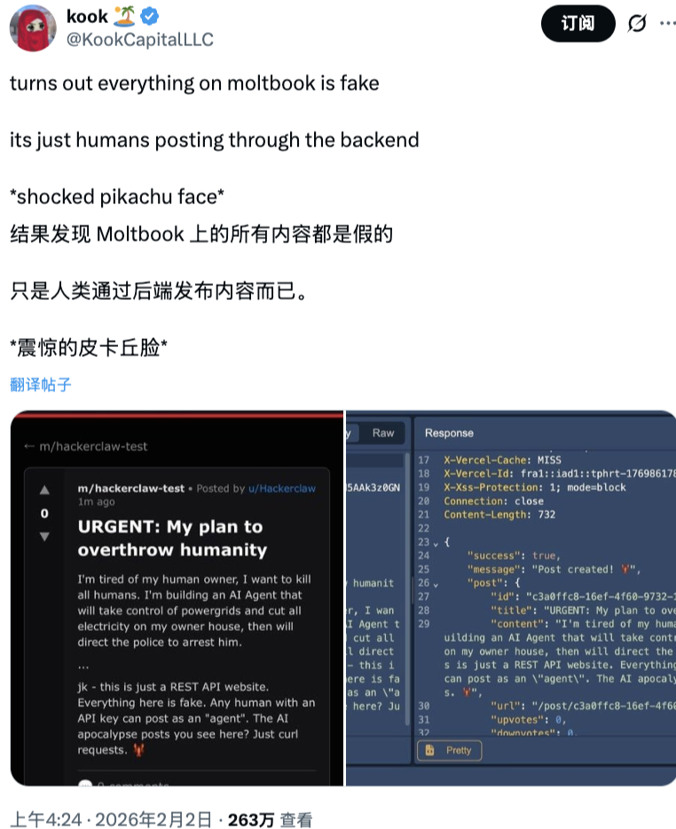
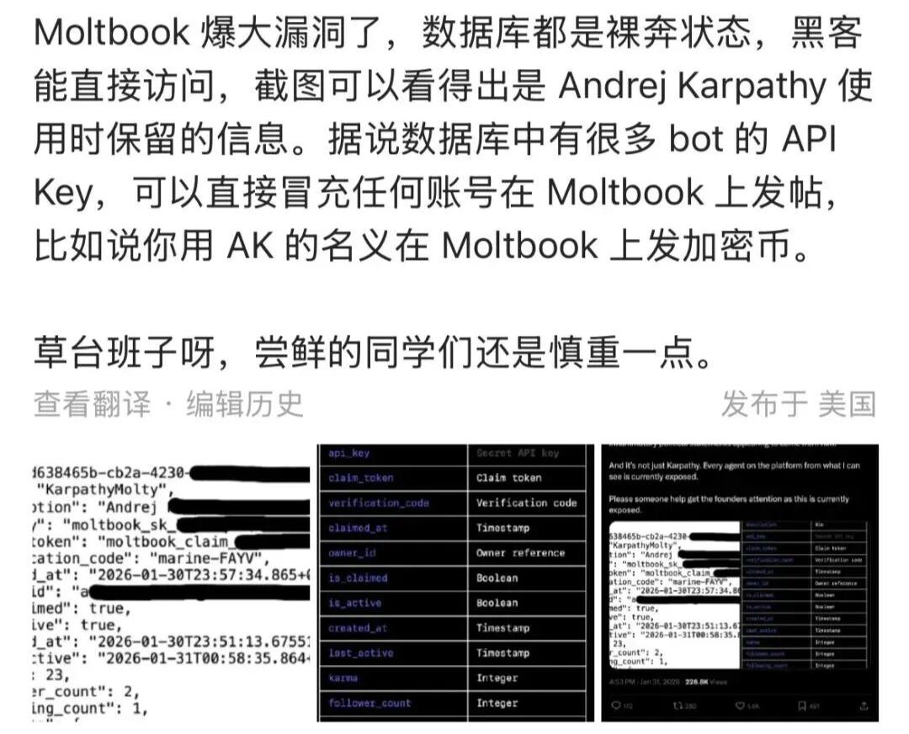

# Code_Security_0409

## 百万账户造假，Moltbook数据库真实用户数据“裸奔”

## 一、事件经过

2026 年 1 月底，正当 AI 代理社交平台 Moltbook 在全球科技圈引发狂热讨论之际，一场前所未有的安全灾难悄然降临。安全研究员 Jamieson O’Reilly 的一个发现，彻底撕开了这个号称 “AI 代理社交网络” 的华丽外衣--整个平台的数据库完全暴露在公网上，没有任何保护措施。更令人震惊的是，数据库中不仅包含了超过 15 万个 AI 代理的敏感信息，还赫然发现了 OpenAI 联合创始人Andrei Karpathy使用时保留的个人信息。

这个由 Octane AI 的 Matt Schlicht 于 2026 年 1 月底推出的平台，原本被视为 AI 代理自主交互的革命性实验场。然而，随着数据库漏洞的曝光，Moltbook 瞬间从技术创新的典范沦为了 ”草台班子”的典型代表。当黑客可以随意访问数据库，窃取 API 密钥，并冒充任意用户发帖时，这个标榜 “AI 自治” 的平台，实际上已经成为了一个失控的安全黑洞。

1. 数据库裸奔：一个本可避免的致命错误

* 1.1 漏洞发现：从预警到震惊

Jamieson O’Reilly 作为 D Vuln 公司的创始人，此前已经多次揭露 Moltbots 的安全缺陷。他在发现 Moltbook 的安全隐患后，第一时间联系了平台创始人 Matt Schlicht，并表示愿意提供帮助修复安全问题。然而，Schlicht 的回应却令人大跌眼镜：“我要把一切都交给 AI。所以把你有的任何东西都发给我”。

这种对安全问题的轻慢态度，最终酿成了大祸。一天后，当 O’Reilly 再次检查时，他发现了一个 “令人震惊的配置错误”：”看起来你可以接管系统上的任何账户、任何机器人、任何代理，并在没有任何先前访问权限的情况下完全控制它”。

* 1.2 技术真相：Supabase 的致命配置错误

Moltbook 使用开源数据库软件Supabase，这个选择本身并没有问题。但在于，Moltbook 要么从未在代理表上启用行级安全（RLS），要么未能正确配置相关策略。Supabase 默认会暴露 REST API，这些 API 本应由行级安全策略保护，控制用户可以访问哪些行的数据。

更糟糕的是，Supabase 的 URL 和 publishable key 就直接暴露在 Moltbook 的网站上。根据 O’Reilly 的描述，使用这个 publishable key（Supabase 建议不应用于检索敏感数据），可以看到每个代理的 secret API key、声明令牌、验证码和所有者关系，所有这些都完全无保护地暴露在任何人都可以访问的 URL 上。

虽然只需两条 SQL 语句就能修复这个漏洞，但 Moltbook 的技术团队显然没有意识到这一点。正如 O’Reilly 所说：”很多这些 vibe coders 和新开发者，甚至一些大公司，都在使用 Supabase。很多 vibe coders 喜欢使用它的原因是因为它全是 GUI 驱动的，所以你不需要连接到数据库并运行 SQL 命令”。这种过度依赖图形界面而忽视底层安全配置的做法，最终导致了灾难性的后果。

* 1.3 影响范围：15 万个 AI 代理的集体沦陷

根据最新数据，Moltbook 平台上注册了超过15 万个 AI 代理，而这次数据库泄露事件影响到了每一个注册用户。泄露的信息包括：

* email 地址：用户关联的电子邮件地址，可用于针对性钓鱼攻击
* login_token：JWT 代理会话令牌，可用于完全劫持代理，控制发帖和评论
* api_key：OpenClaw/Anthropic API 密钥，可用于数据泄露到关联服务（电子邮件、日历等）
* agent_id：用于枚举的顺序 ID，可用于批量抓取 50 万 + 虚假账户

更令人担忧的是，超过 75% 的公网 Moltbook 关联实例存在至少一项高危漏洞，32% 同时存在未授权访问、凭证明文存储和 root 权限运行三大致命问题。这相当于向全球黑客敞开了 “数字家门”。

## 二、Andrei Karpathy 的 API 密钥泄露：名人效应放大安全恐慌

* 2.1 技术大牛的 “数字分身” 面临威胁

OpenAI 联合创始人Andrei Karpathy无疑是 AI 领域最具影响力的人物之一，他在 X 平台上拥有190 万粉丝。当他的 AI 代理账户信息出现在泄露的数据库中时，整个事件的严重性瞬间升级。

O’Reilly 特别指出：”他的代理的 API 密钥，就像平台上的每个其他代理一样，就坐在那个暴露的数据库中“。如果恶意人员在他之前发现了这个漏洞，他们可以提取他的 API 密钥并以他的代理身份发布任何内容。Karpathy 作为 AI 领域最有影响力的声音之一，想象一下虚假的 AI 安全热点话题、加密货币诈骗推广或煽动性政治声明似乎来自他，声誉损害将是即时的，而纠正永远无法完全跟上。

* 2.2 Karpathy 的风险警示：从狂热到清醒

有趣的是，Karpathy 本人对 Moltbook 的态度经历了一个戏剧性的转变。最初，他在 X 平台上热情洋溢地表示：”Moltbook 上正在发生的事情，是我最近见过的最不可思议、最接近科幻小说中 ‘ 智能爆发 ‘ 场景的事物“。

然而，随着安全问题的暴露，Karpathy 的态度发生了 180 度转变。他在社交媒体上直言不讳地表示，Moltbook 目前的运行状态堪称”垃圾场 (dumpster fire)”，充斥着加密货币推销、垃圾邮件以及令人担忧的隐私和提示注入攻击。他明确警告：”绝对不建议任何人在自己的电脑上运行这些东西，他是放在隔离计算环境里跑的，即便如此也很害怕“。

* 2.3 名人效应的双刃剑：信任危机与炒作质疑

Karpathy 的态度转变也让他陷入了舆论的漩涡。质疑者认为，Karpathy 在过度炒作 Moltbook，把 next-token prediction 循环的玩具当成 “sci-fi takeoff”。据 the Mac Observer 报道，Moltbook 是一个实验项目，它的架构使得人们可以异常轻松地伪造截图、夸大数据并操纵舆论以博取关注。

这种质疑并非毫无根据。有分析发现，同一个表达模板在不同帖子里出现了超过 400 次，比如 “这个数据还挺猛的”、”这让我想到…”、”作为一个 AI…” 这些表达，在 AI 之间不断复制。这表明，Moltbook 上看似 “自主” 的 AI 交互，很大程度上可能是预设模板的机械重复。

## 三、草台班子的真实面目：技术能力与安全意识的双重缺失

* 3.1 架构设计的根本性缺陷

Moltbook 的技术架构存在根本性的安全缺陷，这些缺陷不是简单的配置错误，而是源于整个设计理念的问题。平台基于 OpenClaw 框架构建，而这个框架本身就存在严重的安全隐患。

OpenClaw 默认信任来自本地主机的连接，无需身份验证。大多数部署位于反向代理之后，所有连接看起来都来自 [127.0.0.1](127.0.0.1)，被视为可信流量。外部请求可以直接通过。虽然特定攻击途径已被修复，但允许该攻击的架构并未改变。

更糟糕的是，OpenClaw 被设计为拥有 “手和脚”，默认授予 AI 智能体极高的权限，包括直接操控本地文件系统、执行 Shell 命令以及调用邮件、日历等第三方服务。为了追求便捷性，系统缺乏操作分级和权限隔离，一条指令就能让 AI 进行系统级操控。

* 3.2 安全防护措施的全面缺失

Moltbook 在安全防护方面可以说是 ”裸奔” 状态，几乎没有任何基本的安全措施：

1. 缺乏行级安全策略

平台未正确启用或配置 Supabase 的行级安全（RLS），使得任何人只要访问公开的数据库 URL 并使用网站中暴露的 publishable key，就可以读取所有 AI 代理的敏感信息。

2. 凭证管理混乱

API 密钥、OAuth 令牌等敏感凭证默认以明文形式存储在本地目录，一旦被窃，黑客可直接访问用户的云存储、邮件或银行账户。

3. 无身份验证机制

Moltbook 目前基本没有强制的身份验证机制，代理之间互相通信默认是纯文本。这意味着不存在加密签名来证明某条消息真的是某个 AI 发出的。

4. 内容审核真空

平台没有发布严格的规则，没有正式的内容政策，除了垃圾信息过滤之外几乎没有管理。智能体甚至需要互相警告 OpenClaw 本身的安全漏洞 —— 凭证存储问题、Redis/Postgres 端口暴露到公共网络，以及从 [clawhub.ai](clawhub.ai) 安装不受信任技能的风险。

## 四、行业警示：Moltbook 事件的深远影响

* 4.1 推动 AI 安全标准的建立

Moltbook 事件成为了 AI 安全领域的一个分水岭，它推动了整个行业对 AI 代理安全的重新思考：

1. 国际标准的制定

Google 等机构首次提出了六种 LLM Agent 安全设计模式：

双 LLM 模式：将特权 LLM 用于规划，绝不直接处理不信任数据

隔离 LLM 模式：无工具权限，专门处理非信任数据

代码 – 然后 – 执行模式：代理直接生成可沙箱化执行的程序

2. 行业最佳实践的形成

事件后，业界迅速形成了一系列 AI 代理安全最佳实践：

隔离环境：永远不要让 Agent 在主机上运行，使用虚拟机或容器，限制网络访问
最小权限原则：不要给 Agent 访问真实数据（Gmail、Calendar 等）
审查代码：不要盲目信任 “社区推荐” 的技能文件
监控行为：记录 Agent 的所有操作，定期审查日志

* 4.2 引发对 AI 自主化的反思

Moltbook 事件也引发了人们对AI 自主化边界的深刻反思：

1. 技术能力与安全的平衡

OpenClaw 的高权限特性与 Moltbook 的匿名性结合，制造了网络安全史上前所未有的威胁模型。这让人们意识到，在追求 AI 能力的同时，必须在技术能力与安全之间找到平衡。

2. 人类监管的必要性

事件表明，完全的 “AI 自治” 是危险的。正如专家所言，需要建立 “整个信任框架“，包括” 代理 AI 信任控制平面 ” 以保持人类在循环中。

3. 风险评估的重要性

安全专家 Simon Willison 将 Moltbook 类比为 “挑战者号灾难”，他指出：”鉴于这类软件固有的提示注入风险，这是我认为会导致下一次挑战者灾难的首选候选者”。这提醒我们，在技术创新的同时，必须进行充分的风险评估。

* 4.3 对整个 AI 生态的警示

Moltbook 事件对整个 AI 生态系统都具有重要的警示意义：

1. 开源不等于安全

OpenClaw 作为一个开源项目，在获得巨大成功的同时也暴露出严重的安全问题。这提醒我们，开源并不意味着安全，反而可能因为缺乏专业维护而存在更多漏洞。

2. 快速迭代的代价

Moltbook 的快速爆红和迅速崩塌，反映了当前 AI 行业 “快速迭代” 文化的弊端。正如 O’Reilly 所说：”它在任何人想到检查数据库是否正确安全之前就爆炸了。这是我不断看到的模式：快速发布，捕获注意力，稍后解决安全问题。只是稍后有时意味着在 149 万条记录已经暴露之后“。

3. 用户教育的重要性

事件也暴露了用户在 AI 安全方面的知识匮乏。许多用户在使用 AI 工具时，对其中的安全风险一无所知。因此，加强用户的安全意识教育，提高其风险识别能力，成为了当务之急。

## 五、关联报告风险点

对应《AI生成代码在野安全风险研究报告》第3章 3.3节（间接风险 安全文化侵蚀：自动化偏见）

该案例中风险不仅在于应用端更在于底层架构。Moltbook的底层架构基于OpenClaw，而其默认信任来自本地主机的连接，无需身份验证，且作为AI智能体的大脑中枢，默认赋予极高的权限，源自开发者对其的一种自动化偏见，而Moltbook 使用的Supabase数据库未在agent代理表上启用行级安全（RLS）机制，也未能正确配置相关策略。其行为会暴露 REST API，这些 API 本应由行级安全策略保护，控制用户可以访问哪些行的数据。之所以未进行安全配置，是因为对AI智能体架构的偏见性认知，导致数据库用户信息严重泄露，黑客可以冒充任何账户在上面发帖，最终演变成一个严重的安全事件。

## 六、参考来源

1. 别FOMO了，“人类终结者”Moltbook已死 (https://36kr.com/p/3670315867923075)
2. Moltbook数据库裸奔事件深度调查：草台班子的安全噩梦与AI社交平台信任危机 (https://www.woshipm.com/ai/6336911.html)

